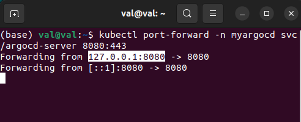

## HOW TO SET UP ARGOCD FOR CONTINOUS DELIVERY


### INTRO:
ArgoCD is an open-source tool for continuous delivery on Kubernetes. It automates the deployment of applications and infrastructure to a cluster. It uses a declarative approach to configuration management. It provides a user-friendly web interface and CLI for managing deployments. ArgoCD ensures that the desired state is always maintained.

<hr>

## INSTALLING AND CONFIGURING ARGOCD
#### Prerequisite:
Minikube and kubectl have to be installed on your system.

### MINIKUBE
Check in your terminal minikube is running on your system by running:

```
minikube status
``` 

And if its not running, then run: 

```
minikube start
```


<br>
<br>

### CEATE A NAMESPACE FOR YOUR ARGOCD
We are going to use the following commands to create a namespace `myargocd`

```
kubectl create namespace argocd
```

```
kubectl apply -n argocd -f https://raw.githubusercontent.com/argoproj/argo-cd/stable/manifests/core-install.yaml
```


NB: When you run the above commands it will take some seconds for services and pods to be created, so it advisable to have some patients before continuing 

## PODS
To view the pods/services created simply run the following commands

```
kubectl get pod -n myargocd
```


To view your services that argocd has set up for you run this command

```
kubectl get svc -n myargocd
```


## RUN YOUR SERVER

To run your server and be able to visualize the UI of your application pipeline, use the following command while attaching your argocd namespace as well as attaching your port:

```
kubectl port-forward -n myargocd svc/argocd-server 8080:443
```


## OPEN ARGOCD LOGIN PAGE
Copy the port you have assigned and then open in your local browser, it will show you a security page, kindly click `ADVANCED` button and click on `proceed to 127.0.0.1(Unsafe)`:


## LOGIN INTO ARGOCD

When you click on `proceed to 127.0.0.1(Unsafe)`, argocd page will automatically open and then you can login


By default the username is `admin`, and the password for the user is auto generated and stored as txt fiel into the password file named `argocd-initial-admin-secret`, so open the secret file on the terminal using the following command.
This will also display it in a yaml format using the `-o yaml` format.

```
kubectl get secret argocd-initial-admin-secret -n myargocd -o yaml
```


## DECODE PASSWORD
The password is in base64 encodind, you might want to decrypt that using the `echo` function:

```
echo <password> | base64 --decode
```


Copy the passowrd to the password input field and you are logged in to your argocd UI service dashboard


<hr>

### Author
## Valentine Eze